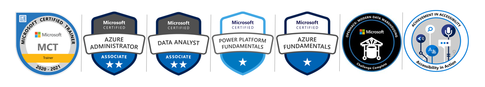

Welcome to my site.

I am a Customer Engineer on the Global Techincal Team for Azure Data and AI at Microsoft. Working at Microsoft has been a long time dream for me and I am ecstatic that it has come true. 

Below are my current certifications.

I have been working (getting paid), in IT since the turn of the century, but I have been passionate about technology for as long as I can remember.

Most of my career has been about Data, as an Oracle DBA, SQL Server DBA, Business Intelligence Architect/Developer, and many years ago a SAP Basis Admin. Currently, my interests are Business Intelligence, Big Data, AI and Cloud technology

Before becoming a professional, I dabbled with web development, working mainly with ASP.NET, C#, PHP, MySql.

I have two Bachelor Degrees, a BS in Computer Science and a BA in Advertising/Communications.

My current skillset: Azure Synapse, Azure Data Factory, Power BI, Azure and on-prem SQL Server Database Administration, other Azxure products, Oracle Database Administration (vers. 10-12), Microsoft Business Intelligence Development (SSIS, SSAS, SSRS), Agile Data Warehouse Design, Agile Scrum Master training, Systems (AIX, Linux(OEL/RHEL) and Windows 2000-2016), Programming (Powershell, Shell Scripts, C#)

Some of my other interests: Disney, Space, movies, especially tech and documentary movies.

Running: Unfortunately, I have been struggling with leg issues for some time now, so I haven’t been able to do much running, but previously I have completed countless 5k’s, 10k’s, 1/2 marathons and these other races. Marathons (Columbus, OH, Knoxville, TN, 2x Pittsburgh, PA and Philadelphia, PA), 2 x Disney Goofy Race ( 1/2 marathon on Saturday and full marathon on Sunday)

Coaching youth baseball, softball and soccer on and off since 2010.

A few things that many people don’t know about me. I founded the first ever all Digital Film Festival in the world. I wrote, directed and edited a feature length film, it was not very good though. I won a trip for being the top vacuum cleaner salesman in the region. I hung out with Bill Murray and Woody Harrelson on the set of Kingpin. I won numerous billiards tournaments while a teenager. I rebuilt the engine of a 1979 Camaro Z28. I had blogger credentials for the 2009 and 2010 Oracle Open Worlds. I once worked out in a hotel gym with President Obama on the elliptical beside me.

